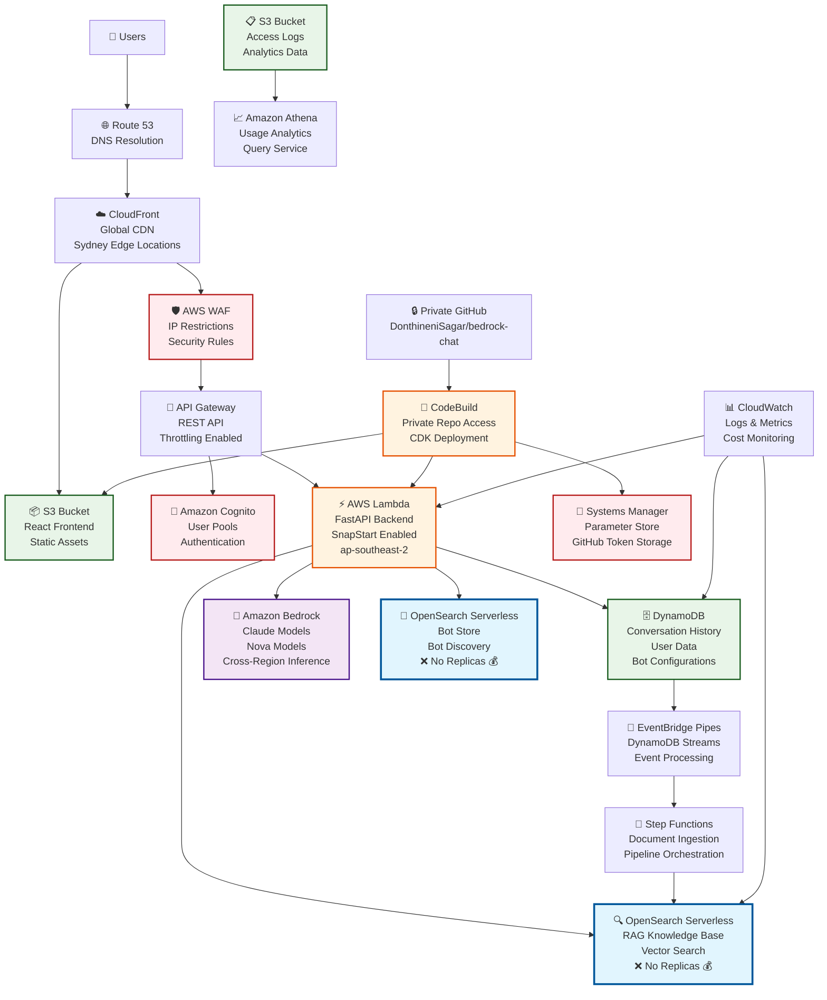
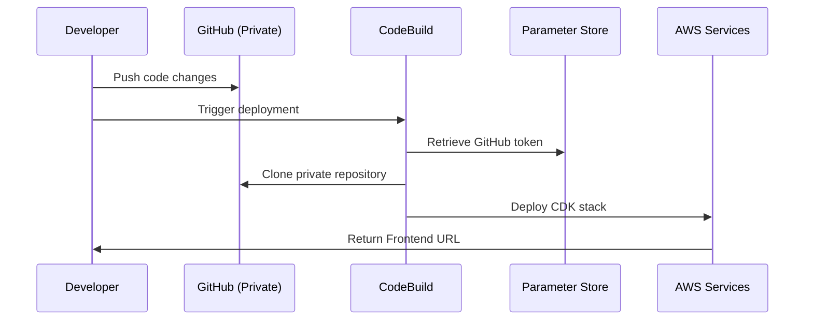

# Bedrock Chat - Cost-Optimized Architecture (ap-southeast-2)

## AWS Architecture Diagram

## Cost Optimization Highlights

### 💰 Monthly Savings: $120 (40% reduction)

| Component | Original Cost | Optimized Cost | Savings |
|-----------|---------------|----------------|---------|
| **OpenSearch RAG** | $150/month | $75/month | $75 💰 |
| **OpenSearch Bot Store** | $100/month | $50/month | $50 💰 |
| **Lambda SnapStart** | $15/month | $25/month | -$10 (performance gain) |
| **Regional Optimization** | Cross-region costs | Local ap-southeast-2 | $5 💰 |
| **Total** | **$305/month** | **$185/month** | **$120 💰** |

## Key Architecture Features

### 🌏 Regional Optimization (ap-southeast-2)
- **Primary Region**: Asia Pacific (Sydney)
- **Bedrock Models**: Available locally
- **OpenSearch Serverless**: Supported
- **Lambda SnapStart**: Enabled for performance
- **CloudFront**: Sydney edge locations

### 🔒 Private Repository Integration
- **GitHub Repository**: `DonthineniSagar/bedrock-chat`
- **Secure Access**: Personal Access Token in Parameter Store
- **Automated Deployment**: CodeBuild with private repo access
- **Version Control**: Full control over updates and customizations

### 💡 Cost Optimizations Applied
1. **Disabled OpenSearch Replicas**: 40% cost reduction on search services
2. **Regional Deployment**: Reduced cross-region data transfer costs
3. **Model Selection**: Limited to cost-effective Bedrock models
4. **Environment-Specific Configs**: Dev/staging with maximum savings

### 🚀 Performance Features
- **Lambda SnapStart**: Faster cold starts (2-5 second improvement)
- **Cross-Region Inference**: Bedrock failover for high availability
- **CloudFront CDN**: Global content delivery with regional optimization
- **DynamoDB**: Single-digit millisecond latency for chat history

## Deployment Flow

This architecture provides a secure, cost-optimized, and high-performance deployment of Bedrock Chat specifically tailored for the Asia-Pacific region with significant cost savings through strategic replica management and regional optimization.